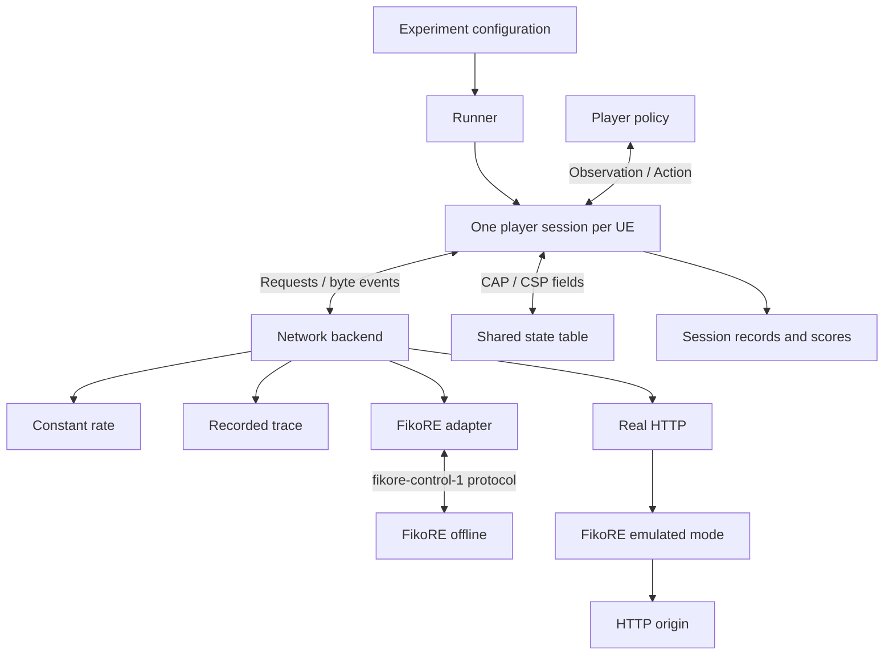

# CAP–CSP Pilot Specification

This specification defines a test harness for short-form video experiments with CAP–CSP information sharing. The design decouples the player, the experiment runner, and the network backend. A player requests media objects of known sizes, and a network backend reports when bytes arrive.

The same player logic can run against four different backends:

1. a constant rate model
2. a recorded trace
3. FikoRE in offline co-simulation
4. real HTTP traffic through FikoRE in emulated mode

The design is based on the [research plan](https://docs.google.com/document/d/1JH8LQ5bbNjfzoaymn4FptL_odv6txNAn-5TOC6kdAFE/edit?tab=t.0) and subsequent meetings. Meeting notes live in [this Google Doc tab](https://docs.google.com/document/d/1JH8LQ5bbNjfzoaymn4FptL_odv6txNAn-5TOC6kdAFE/edit?tab=t.a7zfcry4xais).

## System Architecture

The Python harness manages experiment state, network backends, shared state, and scoring. A JavaScript player manages application state in all modes: as a Node.js process behind the network backend interface in modeled and offline runs, and as a multi-video dash.js player during real-HTTP validation. FikoRE manages radio models and queues in both modes, and virtual time in offline mode.

Offline FikoRE does not receive video payloads. The harness requests delivery of an opaque object of a given byte size, retaining the mapping from request ID to video metadata, segment, quality, and score metrics.

## Key Design Principles

- One runner orchestrates multiple player sessions, typically one per video UE.
- A **player policy** receives state observations and just returns requests or cancellations.
- Segments from multiple videos can transfer concurrently.
- A common **network-backend interface** abstracts constant rate, trace replay, FikoRE co-simulation, and real HTTP.
- FikoRE drives virtual time in offline mode; the player makes playback and swipe decisions against this clock.
- Offline runs do not simulate HTTP. A configurable transport model (for example TCP) carries bytes over the selected link.
- A Python adapter in the harness isolates FikoRE's general-purpose control interface from pilot-specific logic; the emulator learns nothing about videos, objects or requests.
- Real-time emulation remains available to validate policies against real traffic using real players (e.g., dash.js).
- Real HTTP traffic routes through FikoRE in emulated mode to an HTTP origin server.
- The same JavaScript policy code runs in offline simulation and in the multi-video dash.js player for real-HTTP benchmarking.

## Document Map

Procedural stuff:

- [Architecture](architecture.md): components, state ownership, time models, and execution modes.
- [Implementation Plan](implementation-plan.md): package layout and development milestones.
- [Decision Status and Action Items](decision-status-and-todos.md): unresolved decisions and implementation work.

Specific API decisions:

- [Player API](player-api.md): player state, policy observations, actions, swipe models, preloading, and concurrency.
- [Network Backend API](network-backend-api.md): common request and event interface across network backends.
- [FikoRE Co-simulation](fikore-cosim.md): adapter boundary, synchronization, delivery guarantees, and FikoRE modifications.
- [Co-simulation Messages](fikore-cosim-messages.md): JSON wire protocol schema and examples.
- [Signaling and Shared State](signaling.md): signaling levels L0–L4 and CAP–CSP information exchange.
- [Experiments and Configuration](experiments.md): experiment matrices, reproducibility, network conditions, and media sets.
- [Results and Scoring](results-and-scoring.md): event logging, byte attribution, KPIs, and composite scores.

## Specification Terms

- **Required**: essential behavior that the harness or backend abstraction requires.
- **Proposed**: recommended default implementation that can be modified without altering the core architecture.
- **Open**: pending decision or design needing empirical validation.
