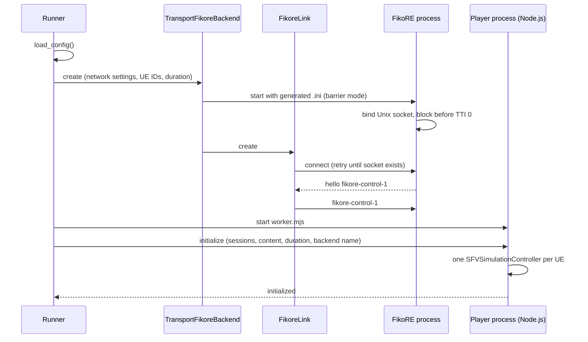
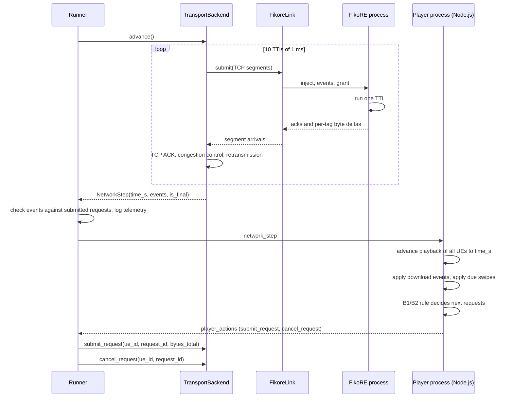
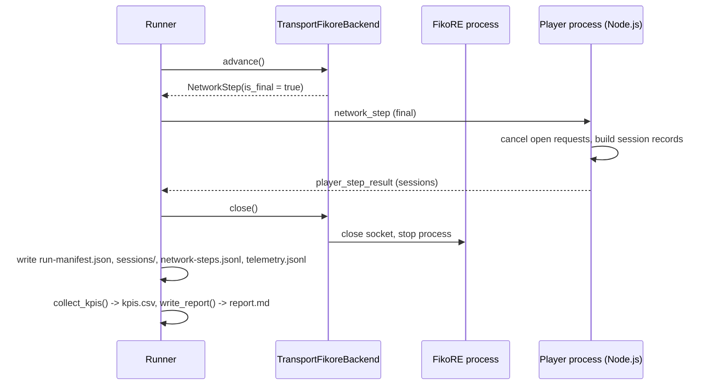
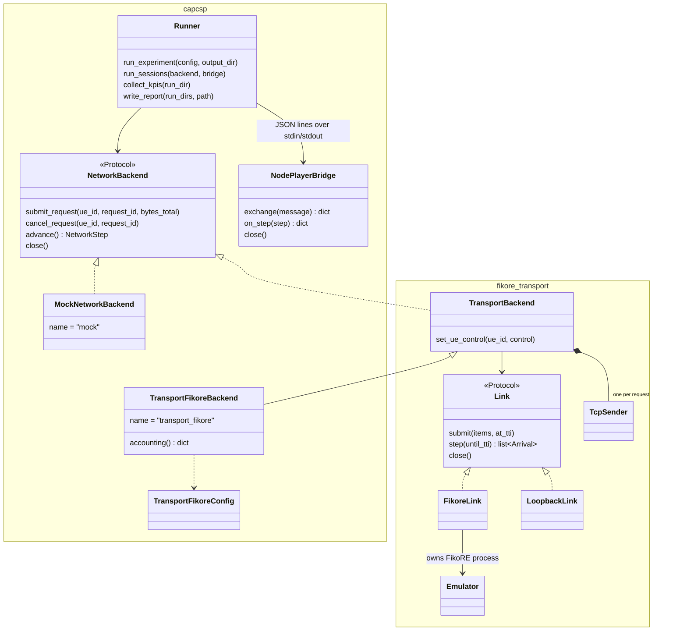
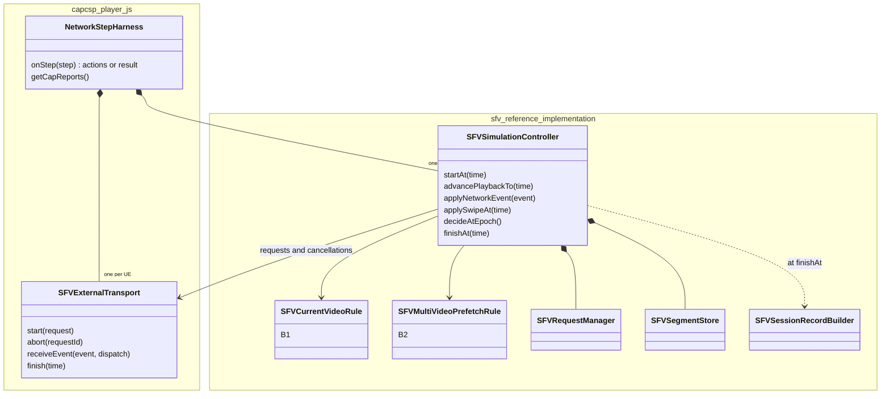

# System Architecture

The pilot evaluates how short-form video players and a mobile network share information. It supports a fast offline path for parameter sweeps and a real-traffic path for validation.

## Design Goals

- Write player and prefetch policies once and run them against any network backend.
- Keep video semantics out of FikoRE; FikoRE transfers bytes for opaque requests.
- Keep radio details out of the player; the player observes byte arrivals and permitted CSP fields.
- Support multiple UEs and concurrent requests per UE.
- Ensure offline runs are deterministic from configuration and seed.
- Run the same JavaScript policy code offline and in dash.js.
- Record per-segment logs to explain every quality score and wasted byte.

## Component Ownership

The runner loads configuration, initializes one session per video UE, starts the selected network backend, and writes output metrics.

Each player session manages:

- Ordered video feed
- Current video index and playback position
- Downloaded and playable buffer state
- Swipe model and swipe history
- Active and completed media requests
- Player adaptation policy
- CAP reports and session KPIs

The network backend manages:

- Backend clock
- Request delivery progress
- Transport flows, congestion control and cancellation tails
- Observable network telemetry

FikoRE manages radio states, radio queues, scheduling, channel models, and the offline simulation clock. The implemented offline path separates the generic `TransportBackend` from `FikoreLink`: the former turns anonymous objects into modelled transport flows, while the latter translates segments and feedback to and from `fikore-control-1`.

## Execution Modes

| Mode | Clock | Transport Fidelity | Primary Use |
| :-- | :-- | :-- | :-- |
| Constant rate | Logical time | Linear byte delivery | Player unit and integration tests |
| Trace replay | Logical time | Recorded rate profile | Fast open-loop experiments |
| FikoRE offline | FikoRE simulation clock | Radio scheduling with a modeled transport, no HTTP stack | Multi-UE closed-loop experiments |
| HTTP via FikoRE | Monotonic wall clock | Real HTTP, kernel TCP/IP, or QUIC | dash.js validation runs |

The backends share event semantics but are not expected to yield identical traces. Real HTTP introduces connection handshakes, slow start, loss recovery, and server multiplexing that the offline model abstracts.

## Time Model

Every backend reports elapsed time starting from `0.0` seconds and stamps all events in that time domain.

- Constant-rate and trace backends advance a deterministic logical clock.
- FikoRE serves as the sole clock master in offline co-simulation.
- The HTTP backend converts monotonic system time to elapsed run time.

The runner maintains no independent clock. Playback progress, stalls, user swipes, and download decisions advance strictly from the backend timestamp.

FikoRE simulates 1 ms radio slots internally. The transport advances the link one TTI at a time so ACK, loss and retransmission causality is preserved. The player-facing backend accumulates ten TTIs by default and returns one 10 ms `NetworkStep`.

## Main Loop

The runner (`capcsp/runner/run.py`) creates the network backend and one Node.js player process for all UEs, then exchanges one `NetworkStep` at a time until the backend marks a step as final. The backend yields an initial step at `t = 0.0`, so players can issue startup requests before virtual time advances. A single process manages all video UEs within a cell to capture shared-medium contention and scheduler fairness.

The diagrams below show the `transport_fikore` backend. The `mock` backend replaces `TransportBackend`, `FikoreLink` and FikoRE with an in-memory byte budget; everything else is the same.

### Run Setup



### One Step

The player sees only the serialized `NetworkStep` and answers with opaque request actions. All UEs move to the same time before any event is applied.



### End of Run



## Implementation Structure

The Python side lives in two packages: `capcsp` in this repository and `fikore_transport` in the FikoRE submodule. `capcsp` imports the Network Backend API types from `fikore_transport`.



The Node.js side is a thin layer in `capcsp/player/js/` around the unchanged engine from the `sfv-reference-implementation` submodule.



Each session uses one of the two rules. `SFVExternalTransport` turns the controller's requests into `submit_request` and `cancel_request` actions and keeps the media metadata of each request on the player side.

## Player and Network Decoupling

The player policy selects video segments and quality representations. The harness resolves these selections against a content registry to determine byte sizes.

For a request such as `v8.s1.q2.a0` (video 8, segment 1, quality level 2, attempt 0, size 940,000 bytes), the network receives only:

```text
UE 3, request v8.s1.q2.a0, 940000 bytes
```

The request identifier is an opaque correlation key that the network does not inspect or parse.

## Offline Simulation and Validation Paths

The harness runs the JavaScript engine from the `sfv-reference-implementation` submodule as a subprocess, through the bridge in `capcsp/player/` (adapted from the SFV-VQEG v0.7.2 repository). The engine receives `NetworkStep` events and returns request submissions and cancellations through the [Network Backend API](network-backend-api.md); it never sees backend-specific messages.

The same policy code runs in the browser in a patched dash.js player supporting multi-video short-form playback. That player lets a short-form controller own all requests, with access to the feed queue, download history, and active network requests.

The dash.js client runs against the real-HTTP backend, routing traffic through FikoRE in real-time emulation to an origin web server.

## Milestone 1 Exclusions

The first milestone excludes:

- Video decoding in offline runs
- HTTP, TLS, or QUIC in offline runs
- Cross-backend numerical identity
- Distributed databases or remote message brokers
- Standardized L3 network-control algorithms
- Heterogeneous player policies or mixed signaling levels within a single cell
