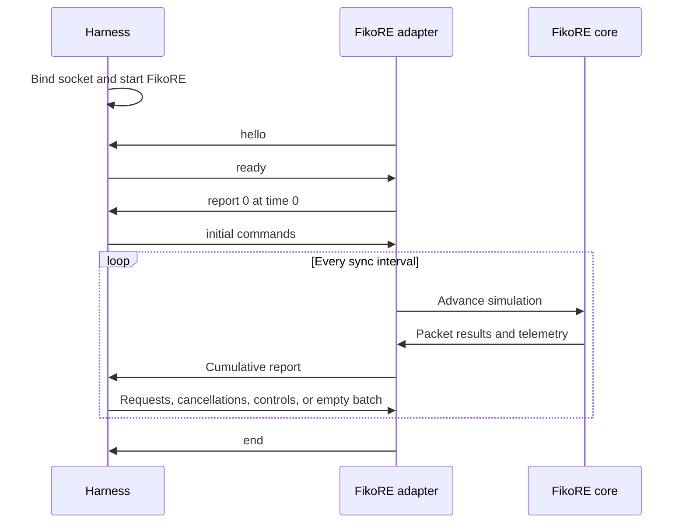

# FikoRE Offline Co-Simulation

Offline co-simulation connects the experiment harness to FikoRE without transferring real video payloads or running HTTP/TCP stacks. The harness submits anonymous object requests with explicit byte sizes. FikoRE converts these objects into packet streams, simulates the radio link, and reports cumulative byte delivery.

This document defines required delivery semantics and the adapter specification. See the [Message Reference](fikore-cosim-messages.md) for the JSON wire format.

## Interface Status

The core architecture requires an object-level boundary: the harness provides a UE ID, request ID, and total byte count; FikoRE reports delivery progress under that request ID.

The Unix domain socket, newline-delimited JSON format, report-command lockstep, and field names form the proposed version 1 wire protocol. The adapter isolates this protocol so FikoRE's core simulation engine remains independent of pilot-specific messaging.

FikoRE must retain its standard behavior unchanged when co-simulation is disabled.

## Component Responsibilities

The harness manages:

- Video, segment, and quality metadata
- Mapping between request IDs and media objects
- Player buffer and swipe state
- Download requests and cancellations
- Experiment configuration and metrics

FikoRE manages:

- Radio state and channel models
- Packet queues and MAC scheduling
- Offline simulation time
- Per-request byte delivery accounting
- Radio telemetry sampled in simulation time

The adapter converts high-level object requests into FikoRE packet structures. The core emulator does not track video segments or player policies.

## Transport Protocol

- One Unix domain stream socket per experiment run.
- The harness creates and binds the socket before starting FikoRE.
- Messages consist of single-line UTF-8 JSON objects terminated by `\n`.
- Communication is synchronous: FikoRE sends a report and waits for a command batch (which may be empty).
- Protocol socket reads have no short timeout to allow interactive debugging.
- The runner maintains an external watchdog process to catch deadlocks or crashes.

## Lifecycle and Clock Synchronization



FikoRE emits report sequence 0 at simulation time `t = 0.0`, allowing the harness to submit initial segment requests before time advances.

For subsequent steps, FikoRE advances by `sync_ms`, sends an aggregated report across all external UEs, and awaits a response. Commands take effect in the next simulation interval. All timestamps and telemetry intervals reflect simulation time.

## Delivery Guarantees

The adapter and FikoRE provide the following delivery semantics:

- Request IDs are unique per UE throughout a run.
- Multiple active requests per UE make concurrent progress within the same reporting interval.
- Progress counters are cumulative and monotonically non-decreasing.
- A request finishes only when all `bytes_total` bytes reach the UE.
- Object submission order does not guarantee delivery order.
- Radio drops and retransmissions do not increment delivered application bytes.
- Identical configuration and seeds yield identical event sequences and byte counts.

The adapter maintains an active-object table per external UE and attaches an opaque request tag to generated packets until final delivery.

## Concurrent Object Scheduling

The radio scheduler services aggregate traffic per UE. The adapter governs how active objects inject packets into the UE transmission queue.

The default scheduling policy is deterministic round-robin across active requests, bounded by an aggregate sender window per UE. This prevents offered load from ballooning when players open multiple requests simultaneously.

The proposed sender window is 128 KiB per UE. This value must be recorded in experiment metadata and calibrated against real HTTP traces.

## Request Cancellation

Upon receiving a `cancel` command, the adapter halts packet generation for that object. Packets already queued in the radio pipeline continue to their final delivery or drop outcome.

The proposed admission boundary is insertion into the per-UE downlink queue. The request remains active while admitted packets drain, then reports a single terminal `cancelled` status with the final delivered byte count.

## Latency Accounting

FikoRE simulates radio-link latency, including queueing delay, scheduling, over-the-air transmission, retransmissions, and core delivery.

The offline adapter does not simulate transport handshakes. Instead, it injects configured non-radio latency (application, origin, and core transport delay) by holding new requests for `synthetic_delay_ms` before feeding them into FikoRE queues.

## Telemetry

Telemetry consumed by player policies must be delivered within co-simulation reports and stamped in simulation time.

Candidate telemetry fields:

- Throughput delivered over the telemetry window
- IP and PDCP one-way latency
- Congestion notifications and drop rates
- Retransmitted bytes
- SINR
- Queue occupancy

The adapter populates only metrics that FikoRE directly measures. Measured throughput must not be labeled as available spare capacity, and one-way latency must not be reported as RTT.

## Configuration

Co-simulation is enabled via the `[cosim]` section in the FikoRE `.ini` file:

```ini
[cosim]
socket_path: /run/cosim/c04-L2-preload-seed17.sock
sync_ms: 10
telemetry_ms: 500
external_ue_ids: 0,1,2,3
sender_max_bytes_in_flight: 131072
seed: 17
```

Validation constraints:

- `sync_ms` is a positive multiple of the internal radio tick.
- `telemetry_ms` and experiment duration align with `sync_ms` multiples.
- `external_ue_ids` are unique and non-empty.
- `sender_max_bytes_in_flight` is positive.
- Pseudo-random number generators initialize reproducibly from `seed`.

Background UEs retain internal traffic generators; co-simulation commands control external UEs only.

## Termination and Error Handling

At session completion, the harness responds to the final report with an empty command batch. FikoRE then transmits `end` and closes the socket. Remaining active requests convert to local cancellation events.

Invalid protocol versions, sequence mismatches, duplicate request IDs, unknown UE IDs, or malformed payloads terminate the run with an error. Empty command batches are valid and expected.

## Adapter Requirements

The FikoRE adapter requires:

- Co-simulation entry point to pause and step emulator execution
- Per-UE active object tracking
- Deterministic packet generation from active objects into UE queues
- Request tagging on internal packet structures
- Cumulative delivered, completed, and cancelled byte tracking per request
- Telemetry aggregation over simulation windows
- Independent random seed derivation for channels, mobility, and background traffic
- Network-side control hook for L3 experiments

## Acceptance Criteria

The adapter is verified when:

- Report 0 accepts initial requests before simulation time advances.
- Multiple active objects for a single UE progress concurrently.
- Multi-UE competition attributes byte deliveries correctly to each session.
- Cancellation stops new packet generation while reporting drained in-flight bytes.
- Cumulative byte counters never decrease or exceed `bytes_total`.
- Identical random seeds produce bit-identical event traces.
- 10 ms step intervals match 1 ms reference traces within acceptable tolerance.
- Disabling `[cosim]` preserves standard FikoRE execution.
