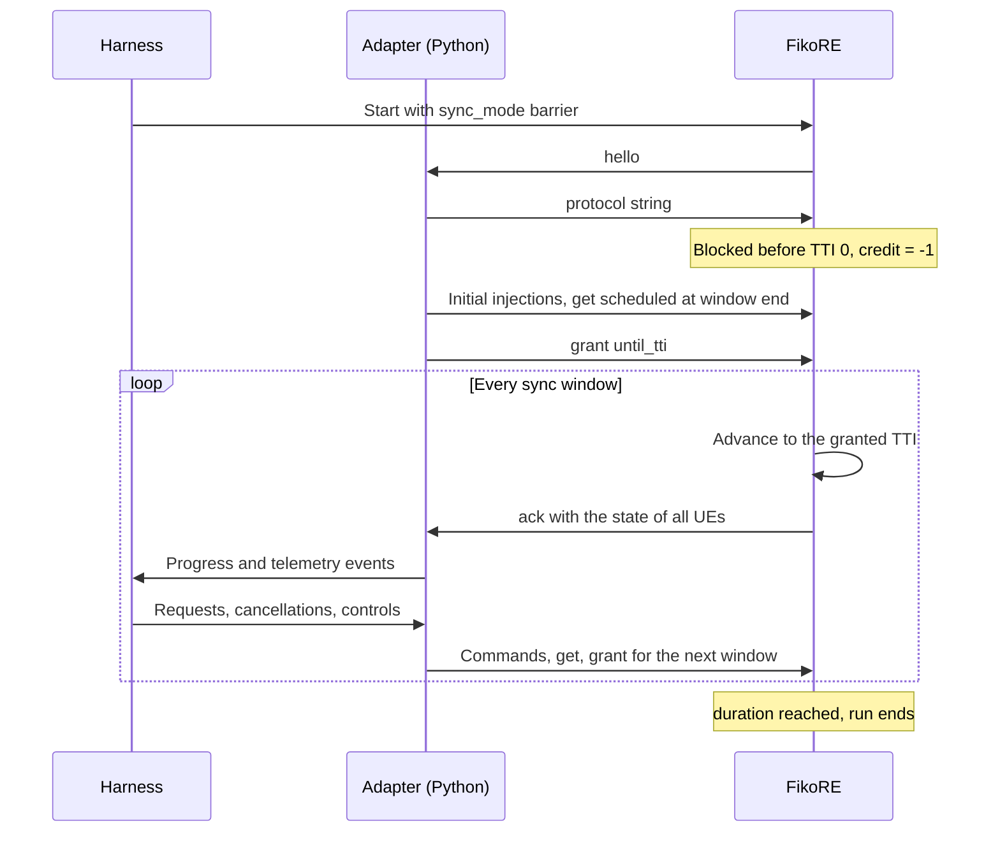

# FikoRE Offline Co-Simulation

Offline co-simulation connects the experiment harness to FikoRE without transferring real video payloads or running an HTTP stack. The harness submits anonymous object requests with explicit byte sizes. FikoRE converts these objects into packet streams, simulates the radio link, and reports cumulative byte delivery.

This document defines required delivery semantics and the adapter specification. See the [Message Reference](fikore-cosim-messages.md) for the wire format.

## Interface Design

The core architecture requires an object-level boundary: the harness provides a UE ID, an object tag, and a byte count; FikoRE reports delivery progress under that tag.

The wire format is `fikore-control-1`, FikoRE's runtime control protocol: newline-delimited JSON over a Unix domain socket, with a credit barrier that lets an external controller own simulated time. It is a general-purpose control plane for the emulator rather than a pilot-specific one, and this specification adopts it instead of defining a second protocol.

The adapter is a Python component of the harness, not a C++ module inside FikoRE. It holds everything the pilot knows and the emulator does not: the object lifecycle, the mapping from request IDs to tags, the sender window, the pacing policy, and recovery of lost bytes. FikoRE only moves bytes for whoever asks.

The generic `fikore-control-1` client lives in the FikoRE repository and is maintained there. The pilot-specific adapter that implements the [Network Backend API](network-backend-api.md) on top of it lives in the harness.

The emulator keeps radio and network behaviour; the harness keeps pilot policy. The sender window, the cancellation boundary, the scheduling across concurrent objects and the loss-recovery rule are policy and still open questions, so they sit on the side that experiments can iterate on.

FikoRE retains its standard behaviour unchanged when the control plane is disabled.

## Component Responsibilities

The harness manages:

- Video, segment, and quality metadata
- Mapping between request IDs and object tags
- Player buffer and swipe state
- Download requests and cancellations
- Object pacing, the per-UE sender window, and recovery of lost bytes
- Experiment configuration and metrics

FikoRE manages:

- Radio state and channel models
- Packet queues and MAC scheduling
- Offline simulation time and the credit barrier
- Per-tag byte accounting
- Radio telemetry sampled in simulation time

FikoRE does not track video segments, request identifiers, object sizes, completion or cancellation. It attaches a four-byte tag to the packets it generates and counts what happens to them.

## Transport Protocol

- One Unix domain stream socket per experiment run, created and bound by FikoRE from its `.ini`. The harness starts the emulator and connects.
- Messages are single-line UTF-8 JSON objects terminated by `\n`.
- FikoRE greets with its protocol string; the harness answers with the same string or the connection is closed. There is no version negotiation.
- One client at a time. A second connection is rejected and closed.
- Communication is request-response: the harness sends, the emulator acknowledges every message with the exact TTI and simulation time of application.
- Socket reads have no short timeout, so a session can be driven by hand for debugging.
- The runner maintains an external watchdog process to catch deadlocks or crashes.

## Lifecycle and Clock Synchronization



The emulator's initial credit is `-1`, so with `sync_mode: barrier` it stops before TTI 0 and the harness submits its first requests before simulated time advances.

For each window the harness sends the window's commands, a `get` scheduled on the window's last TTI, and a `grant` for that TTI. FikoRE applies the commands at the start of the window's first simulation step, before that TTI runs, then runs the window, answers the `get` from the last TTI, and blocks again. Commands take effect on the TTI at which they are applied; all timestamps are simulation time.

The reply reports state one slot before the window closes. Over a 10 ms window that is a 1 ms lag, which the harness records alongside the run metadata.

## Delivery Guarantees

FikoRE provides the following semantics:

- Tags are unique per UE throughout a run.
- Multiple active tags per UE make concurrent progress within the same window.
- Progress counters are cumulative and monotonically non-decreasing.
- Radio drops and retransmissions do not increment delivered bytes.
- Every byte handed to the emulator ends in exactly one terminal state: delivered, dropped, or expired against the delay budget. The three are counted separately, and `dropped` is broken down further into whether the queue or the radio caused it.
- Object submission order does not guarantee delivery order.
- Identical configuration and seeds yield identical event sequences and byte counts.

### Who retransmits

Without a [transport model](network-backend-api.md#transport-models), a byte that is lost is lost for good and an object would never reach `bytes_total`. The adapter recovers it: it reads the tag's `dropped_bytes` and `expired_bytes` and reinjects that many bytes. The object is therefore always delivered in full, at whatever delay the losses cost, which is what a real TCP flow would show the player.

FikoRE's radio carries no HARQ error model — the BLER-driven retransmission path in `harq_handler` is compiled out — so the radio never asks for a second attempt and never exhausts its retransmissions: `retransmitted_bytes_total` reads zero and radio drops do not occur. The delay budget is therefore the loss mechanism, which makes the interaction below the one that decides how much the adapter has to recover.

A request is complete when the adapter has seen `delivered_bytes == bytes_total` for its tag. It then issues `forget` to release the tag's counters, because FikoRE does not know the object's size and cannot tell on its own that it is finished.

## Concurrent Object Scheduling

The radio scheduler services aggregate traffic per UE. The adapter governs how active objects inject bytes into the UE's queue: deterministic round-robin across active tags, bounded by an aggregate sender window per UE.

The window has to be per UE rather than per object because the queue is: a UE has one FIFO, so an object that overfeeds it pushes its neighbours past the delay budget and they expire behind it. Per-object accounting attributes each loss to whoever owned the bits, which is what the adapter needs in order to recover them, but it does not make objects independent.

The proposed sender window is 128 KiB per UE. It lives in the harness configuration, not in the FikoRE `.ini`, and must be recorded in experiment metadata and calibrated against real HTTP traces.

### The window and the delay budget interact

FikoRE's PDCP layer discards any packet that has waited longer than `pkt_delay_budget_s`, which is a radio QoS mechanism and defaults to 0.3–0.35 s. What fits in the queue without being discarded is `budget x rate`:

| Condition | Rate per video UE | In flight without expiry |
| :-- | :-- | :-- |
| Healthy cell, 60 Mbps shared by 4 UEs | ~15 Mbps | ~560 KiB |
| Congested cell, 6 Mbps shared by 4 UEs | ~1.5 Mbps | ~64 KiB |

At the congested end a 128 KiB window loses half of itself to the budget, and a 940 kB segment injected in one go evaporates almost entirely. A real TCP flow has no such ceiling: it does not discard a segment for having sat 350 ms in a queue.

Experiments therefore raise `pkt_delay_budget_s` for the UEs the harness drives, so that the sender window is the only limiter, and keep the budget as a real mechanism on background UEs. The setting is recorded with the run. `expired_bytes_total` staying at zero for driven UEs is the check that this was done right.

That check says the budget is out of the way. It does not say nothing was lost to congestion: the AQM works off its own target, 15 ms by default, so it drops well before the budget would and raising the budget does not stop it. Congestion loss on driven UEs shows up in `queue_dropped_bytes_total`, which is expected to be non-zero at the congested end.

## Request Cancellation

Cancellation needs nothing from the emulator: the adapter stops injecting for that tag. Bytes already handed over continue to their delivery or drop outcome.

The admission boundary is therefore the sender window, which is finer than the per-UE queue: the in-flight tail of a cancelled request is at most what the adapter had already injected, and it is known exactly. Once the tail has drained — `delivered + dropped + expired == injected` for that tag — the adapter emits one terminal `cancelled` event with the final delivered byte count and issues `forget`.

Lost bytes are not recovered for a cancelled object.

## Latency Accounting

FikoRE simulates radio-link latency, including queueing delay, scheduling, over-the-air transmission, retransmissions, and core delivery.

Non-radio latency (application, origin, and core transport delay) can be injected two ways:

- In the harness, by holding a new request for `synthetic_delay_ms` before the adapter starts injecting it. This matches the constant-rate and trace backends.
- In FikoRE, with the `backhaul_d` and `backhaul_d_var` fields of its `.ini`. This applies to every packet rather than only to the first, which is more faithful, and it costs no code.

Milestone 1 uses the first for comparability across backends and records the choice. The second is the better model once the two are calibrated against live FikoRE measurements.

## Telemetry

Telemetry consumed by player policies is delivered in the `get` reply and stamped in simulation time.

It consists of cumulative counters, not per-window means. The harness differences two reads and picks its own window; a lost read costs nothing and the emulator keeps no "since last time" state. It also has to be triggered and stamped in simulation time: FikoRE's monitoring path, the UDP/Influx stream meant for live dashboards, flushes on the wall clock and is of no use in fast mode.

The counters FikoRE measures, and therefore the only ones exposed, are listed in the [Message Reference](fikore-cosim-messages.md#get). In summary: bytes injected, delivered, expired, dropped and retransmitted; packets marked congestion-experienced; bytes and packets queued; age of the oldest queued packet; mean one-way IP latency; mean SINR.

Two cautions carried over into the field mapping:

- Delivered throughput is measured delivery. It is not spare capacity and not the maximum channel rate.
- FikoRE measures one-way latency. `CspFields.rtt_ms` cannot be filled from it without stating the assumption used to get from one to the other.

FikoRE also knows each UE's CQI, MCS, spectral efficiency and rank, from which an achievable rate can be derived. That is a genuine CSP-side quantity, distinct from both measured throughput and an oracle, and it is a candidate L2 field beyond the current signalling design.

## Configuration

Co-simulation is configured entirely from FikoRE's `.ini`, with a `[Control]` block and a run seed:

```ini
[Global]
duration: 300
period: -1               ; fast mode; the barrier is refused in real time
seed: 17                 ; see Seeds below

[Control]
enabled: true
transport: unix
address: /run/cosim/c04-L2-preload-seed17.sock
sync_mode: barrier
credit_timeout_ms: 30000
on_timeout: abort
on_peer_loss: abort      ; see Termination below
journal_file: logs/c04-L2-preload-seed17.ndjson
```

`sync_ms`, the telemetry interval, the sender window and the list of UEs the harness drives are harness configuration. The emulator does not need them: any simulated UE accepts injection, and a UE driven by the harness is simply one configured with `dl_target: 0` so that it carries no generator traffic.

Validation constraints:

- `sync_ms` is a positive multiple of the 1 ms radio tick.
- The experiment duration is a multiple of `sync_ms`.
- The scheduler is proportional fair (`metric_type: 6`). Under round robin the scheduler ignores priority, so an L3 controller would silently do nothing.
- `pkt_delay_budget_s` is set for driven UEs as described above.
- Pseudo-random number generators initialise reproducibly from `seed`.

### Seeds

A boolean `random_v` is not enough on its own: `true` seeds from the wall clock, `false` makes a run reproducible but always the *same* run, and it also zeroes the traffic, backhaul-jitter and retransmission variances. Neither setting expresses "thirty different, each repeatable", which is what the experiment grid and the paired comparisons across signalling levels need.

The design is a `[Global] seed` integer, mixed with a per-stream identifier so that fading, mobility, background traffic and each UE draw independent, reproducible sequences, with the variances honoured. `random_v` then carries only its own meaning, "is there stochasticity at all", and an absent `seed` leaves behaviour as it is.

The runner generates one `.ini` per run from a base template. Three emulator details constrain that generation: the telemetry UDP port and the socket path must be unique per concurrent run; log file names derive from the UE group identifier, so runs need separate working directories; and FikoRE resolves its fading maps relative to the binary, so a copied or containerised binary needs the map directory beside it.

## Termination and Error Handling

At the scheduled duration FikoRE ends the run and closes the socket. Remaining active objects convert to local cancellation events in the harness.

A run that loses its controller must fail stop, not carry on: 200 s of simulation with no requests would otherwise be written out as if it were data. Two settings govern this, and both are set to `abort` for experiments:

- `on_timeout: abort` ends the run when no credit arrives within `credit_timeout_ms`.
- `on_peer_loss: abort` ends the run when a controller that had connected goes away. The alternative, carrying on free-running to the scheduled duration, suits an operator watching a single live run rather than a grid of unattended ones.

Invalid protocol strings, unknown UE IDs, unknown knobs, out-of-range values and malformed payloads are rejected with an explicit reason in the `ack`; the harness treats any rejection as fatal and aborts the run.

## Adapter Requirements

The adapter, in the harness, requires:

- A `fikore-control-1` client: connect, handshake, send command batches, match acknowledgements
- A FikoRE process wrapper and `.ini` generation from the condition template
- The synchronisation loop: window commands, `get` on the last TTI, `grant`, and event emission
- Per-UE active object tables and the request ID to tag mapping
- Round-robin pacing bounded by the sender window
- Recovery of dropped and expired bytes
- Cumulative delivered, completed and cancelled byte tracking per request
- Translation of `state` counters into `NetworkTelemetry`, with the field mapping logged

The FikoRE side provides:

- The `fikore-control-1` control plane: handshake, commands scheduled at a TTI, acknowledgements stamped in simulation time, and the credit barrier
- Byte injection per UE, tagged per object, with the tag carried through fragmentation and HARQ to the delivery point
- Per-tag delivered, dropped and expired counters, and `forget` to release them
- A run seed with independent per-stream derivation
- The `state` telemetry block, mean SINR and retransmitted bytes included
- Fail-stop on credit timeout and on loss of the controller

## Acceptance Criteria

The adapter is verified when:

- The emulator accepts initial requests before simulation time advances.
- Multiple active objects for a single UE progress concurrently.
- Multi-UE competition attributes byte deliveries correctly to each session, and the sum over tags equals the UE total.
- Cancellation stops new injection while reporting the drained in-flight tail.
- Cumulative byte counters never decrease or exceed `bytes_total`.
- Every object completes despite radio losses, through adapter-side recovery.
- `expired_bytes_total` is zero for driven UEs in every network condition.
- Identical seeds produce bit-identical event traces; different seeds do not.
- 10 ms windows match 1 ms reference traces within an agreed tolerance.
- Disabling `[Control]` preserves standard FikoRE execution.
