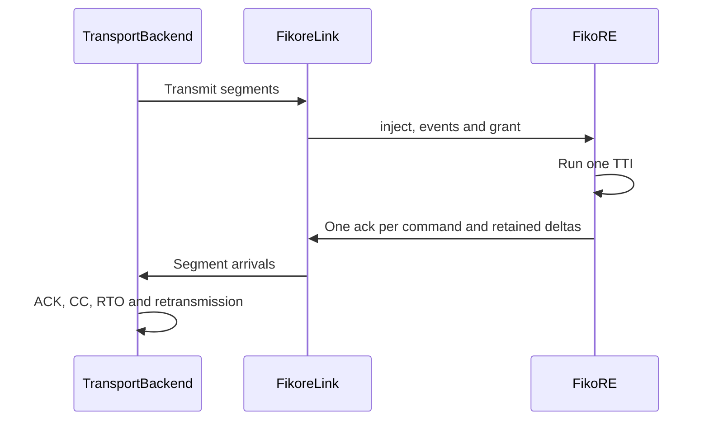

# FikoRE Offline Co-Simulation

Offline co-simulation connects an object-oriented `NetworkBackend` to FikoRE without transferring video payloads or running HTTP. A modelled transport turns application objects into segments; FikoRE supplies the radio, queues, scheduler, loss, delay and ECN outcomes.

The implementation is shipped in the [`5g-network-emulator/transport/`](../5g-network-emulator/transport/) submodule. The detailed wire format is in the [Message Reference](fikore-cosim-messages.md).

## Implemented Boundary

```text
JavaScript player
  │ submit_request / cancel_request / NetworkStep
  ▼
Python bridge or common harness
  ▼
TransportBackend
  │ one transport flow per object
  ▼
TCP (Reno/CUBIC/Prague) or ideal diagnostic transport
  ▼
FikoreLink
  │ inject / events / forget / grant
  ▼
FikoRE
```

The player and common harness never exchange FikoRE wire messages. They retain video metadata and opaque request IDs. `FikoreLink` assigns integer tags to transport segments and maps terminal network outcomes back to their flows.

## Responsibilities

The player and common harness own:

- video, representation and segment metadata;
- request IDs, swipes, playback, cache and wastage;
- policy decisions and session records;
- CAP/CSP information exchange.

The transport package owns:

- object lifecycle and cancellation tails;
- TCP sender/receiver state, congestion control, ACK/SACK and RTO;
- transport pacing and receive-window limits;
- request-to-flow and flow-to-UE mapping;
- conversion to generic `NetworkStep` events.

FikoRE owns:

- radio state and channel models;
- PDCP/MAC queues and scheduling;
- delay-budget expiry, queue/radio drops and ECN marking;
- mobility and runtime UE controls;
- simulated time and the credit barrier;
- retained per-tag network accounting.

FikoRE does not know application request IDs, video metadata or object size.

## Lockstep and Time

The emulator binds one Unix stream socket and starts in `sync_mode: barrier`. Initial credit is `-1`, so it blocks before TTI 0 until the client connects and grants time.

The implemented transport advances one 1 ms TTI at a time:


```mermaid
sequenceDiagram
    participant T as TransportBackend
    participant L as FikoreLink
    participant F as FikoRE
    T->>L: Transmit segments
    L->>F: inject, events and grant
    F->>F: Run one TTI
    F->>L: One ack per command and retained deltas
    L->>T: Segment arrivals
    T->>T: ACK, CC, RTO and retransmission
```

An outcome produced in TTI `n` becomes observable at the next quiescent point. The default backend returns one player-facing `NetworkStep` after ten internal TTIs. This 10 ms cadence does not weaken 1 ms transport causality.

## Feedback and Conservation

`events` returns retained per-tag counter deltas after a cursor. The client advances the cursor only after validating and consuming the complete response. A repeated cursor replays the same deltas. An asynchronous gap requires an explicit atomic `resync`; barrier overflow terminates the run before feedback is lost.

Every injected byte reaches exactly one terminal network fate:

```text
injected = delivered + queue_dropped + radio_dropped + expired
```

CE is a property of delivered bytes, not another terminal fate.

`get` remains available for diagnostics. The transport path uses `events` with optional compact state because serializing every live object on every TTI does not scale.

## Transport Recovery

TCP senders do not read FikoRE's loss counters as an oracle. They infer loss from ACK/SACK or retransmission timeout and retransmit the missing sequence range. Reno, CUBIC and Prague therefore react through transport observations, not through pilot-specific reinjection.

The `ideal` diagnostic mode is the deliberate exception: it uses a fixed shared window and can recover immediately from terminal link outcomes. It is useful for comparing a transport controller with an optimistic injection rule, but is not TCP.

## Object Completion and Cancellation

`TransportBackend` currently creates one transport flow per object. A request completes when its receiver has delivered `bytes_total`.

Cancellation stops new application data immediately. Segments already admitted to the transport or network retain request attribution and drain as a cancellation tail. The backend emits one terminal cancellation event after the data tail drains, and retires the flow after any reverse-path ACK tail drains.

`forget` releases segment-tag counters only after their terminal feedback is acknowledged.

## Telemetry

The compact state accompanying `events` exposes delivered throughput, queue and loss counters, one-way PDCP/IP latency, SINR and mobility. The transport measures RTT from its own acknowledgement path. `rtt_ms` and one-way `pdcp_latency_ms` remain separate measurements.

## Default SFV Configuration

The SFV validator uses [`config/control_demo.ini`](../5g-network-emulator/config/control_demo.ini) as a template. `EmulatorConfig` writes a temporary effective configuration:

- `duration`: SFV duration + 1 s process margin
- `period`: `-1` fast mode
- `n_ues`: number of sessions in the SFV JSON
- `dl_target`, `ul_target`: `0.0`; all bytes come from the client
- `pkt_size`: 12000 bits = 1500-byte MSS
- `pkt_delay_budget`: 30 s for the validation
- `random_v`: `false`
- `sync_mode`: `barrier`
- `on_timeout`: `abort`
- `max_object_events`: 65536
- monitoring output: disabled

The template keeps the 20 MHz, 3.5 GHz scenario, proportional-fair scheduler, static UEs at 300 m and equal DL/UL TDD ratio. The backend uses CUBIC, a 128 KiB receive window, downlink, Not-ECT and a 10 ms player-facing window.

`--config` in `validate_sfv.py` selects the SFV experiment JSON; it does not select another FikoRE INI template.

### Seeds

FikoRE accepts a run seed and derives independent streams for fading, mobility and traffic. Experiment grids must record the seed and use the same value for paired signaling-level comparisons. The SFV integration fixture uses `random_v: false` for a deterministic seam check rather than a seed sweep.

## Failure Semantics

Malformed replies, cursor gaps, over-accounting or lost control connectivity fail the Python run. FikoRE returns a non-zero Unix-style status for aborts; barrier event overflow is status 76. Partial output from an aborted run is not valid experiment evidence.

## Validation

The repository includes:

- deterministic transport tests over `LoopbackLink`;
- emulator-backed `FikoreLink` tests for replay, loss and conservation;
- 300 s scale campaigns for objects, expiry recovery and Prague/ECN;
- controller comparison with RFC vectors and ns.py;
- an SFV v0.7.2 mock/FikoRE integration example.

Use [Offline Transport Validation](offline-transport-validation.md) for the reproducible SFV procedure. Current model limitations are documented in [`transport/docs/LIMITATIONS.md`](../5g-network-emulator/transport/docs/LIMITATIONS.md).

## Remaining Pilot Work

The generic transport and link are implemented. Remaining work belongs to the common harness and experiment definition:

- make the temporary Python–Node bridge a permanent harness component;
- select transport profiles per condition;
- calibrate offline models against real HTTP runs;
- execute the complete C1–C5 and signaling-level matrix.
